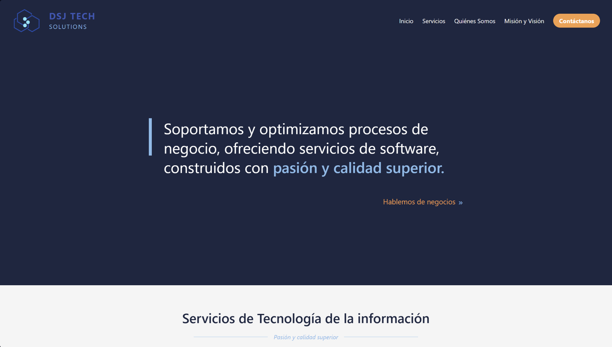
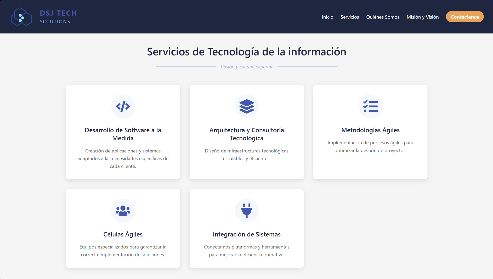
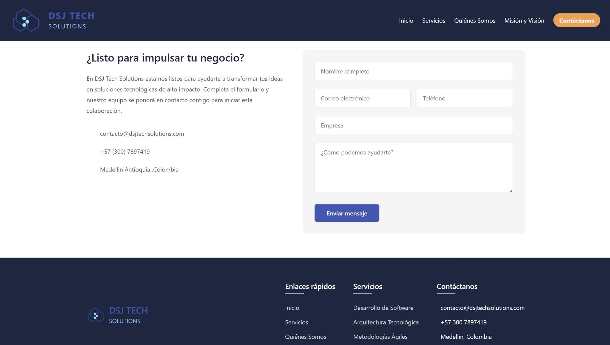

# DSJ Tech Solutions Web

Este proyecto es una página web construida usando **Vite + React**, destacando por su rendimiento rápido y eficiente desarrollo. El diseño enfatiza claridad, profesionalismo y experiencia de usuario intuitiva.

## Tecnologías Principales

- **React** con **Vite** para una carga rápida y optimizada.
- **CSS** para estilos ágiles y escalables.
- **node.js** para uso de modulos oreinstalados en el desarrollo (erramienta de React.js)
- Componentes reutilizables y fáciles de mantener, mostrando asi buenas practicas

## Aspectos Destacados del Diseño

- Diseño minimalista y limpio con enfoque profesional.
- Paleta de colores muy sobria y elegante para proyectar confianza, a peticion del cliente.
- Secciones claras que facilitan la navegación e interacción del usuario.

## Vistas de Referencia

### Inicio

### Servicios

### Contacto

Este proyecto refleja una experiencia digital fluida orientada a impulsar negocios mediante soluciones tecnológicas.
